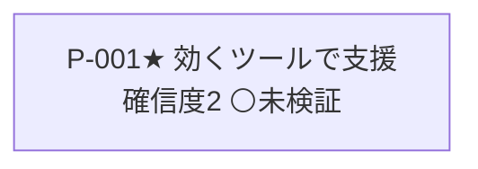

<!-- 生成物: gen_views.py list による機械生成。手編集禁止。`python3 tools/gen_views.py list` で再生成する。生成基準日: 2026-07-22（モード 探索） -->

# 目的仮説リスト（self）

★=核心目的（`core`）。関連列は ← 派生元（`derived-from`）／⟲ 書換（`revises`）／→ 因果先（`leads-to`）／検証活動（ACT）。

## 目的の系譜

## 目的仮説

| ID | タイトル | 確信度 | ステータス | 重要度 | 関連 | 直近の根拠 |
|---|---|---|---|---|---|---|
| [[SELF-P-001]]★ | 効くツールでエンジニアの新領域挑戦を支援する | 2 | ⚪未検証 | 5 | — | 初期作成（勘・思いつき。過去の実体験に裏打ちがあるが未 ingest） |

## 次に外界で確かめるべき目的（確信度低 × 未検証/探索中。⚠️＝試行なし＝最優先）

- [[SELF-P-001]] 効くツールでエンジニアの新領域挑戦を支援する（確信度2・未検証） ⚠️未着手（試行なし）

## ステータス別サマリ

| ステータス | 件数 |
|---|---|
| ⚪未検証 | 1 |
| 🔍探索中 | 0 |
| 🌱立ち上がりつつある | 0 |
| ✅立ち上がった | 0 |
| 🗄️棚上げ | 0 |
