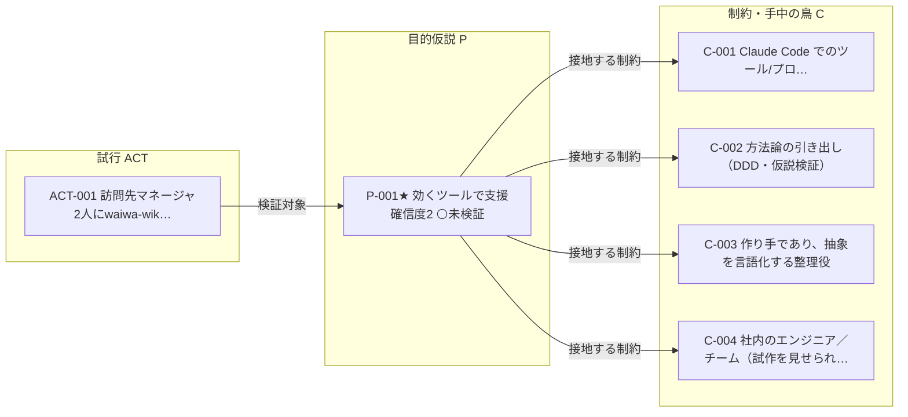

<!-- 生成物: gen_views.py relations による機械生成。手編集禁止。`python3 tools/gen_views.py relations` で再生成する。生成基準日: 2026-07-23（モード 探索） -->

# 関係グラフ（self）

レコード間の型付きリンク（オントロジーの関係）を frontmatter から射影する。ノード=レコード、矢印=関係（ラベル=関係名）。関係の定義は [ontology.md](../../../../ontology.md) を参照。

## 型付き関係グラフ

## 関係インデックス

### 派生元（`derived-from`: P→P）

（該当なし）

### 因果先（`leads-to`: P→P）

（該当なし）

### 接地する制約（`grounded-in`: P→C）

| 始点 | 関係 | 終点 |
|---|---|---|
| [[SELF-P-001]] | 接地する制約 → | [[SELF-C-001]] |
| [[SELF-P-001]] | 接地する制約 → | [[SELF-C-002]] |
| [[SELF-P-001]] | 接地する制約 → | [[SELF-C-003]] |
| [[SELF-P-001]] | 接地する制約 → | [[SELF-C-004]] |

### 書き換え元（`revises`: P→P）

（該当なし）

### 検証対象（`purposes`: ACT→P）

| 始点 | 関係 | 終点 |
|---|---|---|
| [[SELF-ACT-001]] | 検証対象 → | [[SELF-P-001]] |

### 内省対象（`reflects-on`: REF→P）

（該当なし）

### 根拠活動（`based-on`: DEC→ACT）

（該当なし）

## バックリンク索引（誰から・どの関係で参照されているか）

- [[SELF-C-001]] ← 接地する目的: [[SELF-P-001]]
- [[SELF-C-002]] ← 接地する目的: [[SELF-P-001]]
- [[SELF-C-003]] ← 接地する目的: [[SELF-P-001]]
- [[SELF-C-004]] ← 接地する目的: [[SELF-P-001]]
- [[SELF-P-001]] ← 検証活動: [[SELF-ACT-001]]

## 目的↔制約 接地（grounded-in）

各目的仮説がどの手中の鳥（制約C）に接地しているか。空白＝地に足がついていない目的。

| 目的 | 接地する制約 |
|---|---|
| [[SELF-P-001]] 効くツールでエンジニアの新領域挑戦を支援する | [[SELF-C-001]] [[SELF-C-002]] [[SELF-C-003]] [[SELF-C-004]] |

- **未接地の目的**（接地する制約がない）: なし
